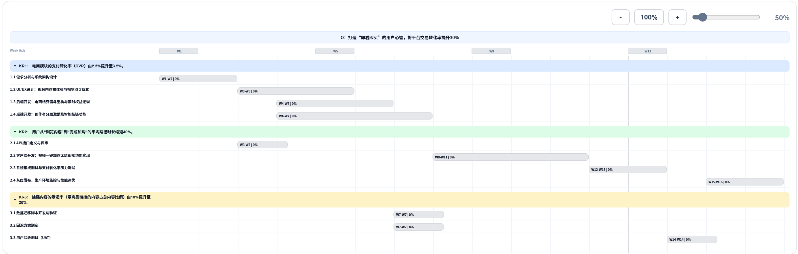
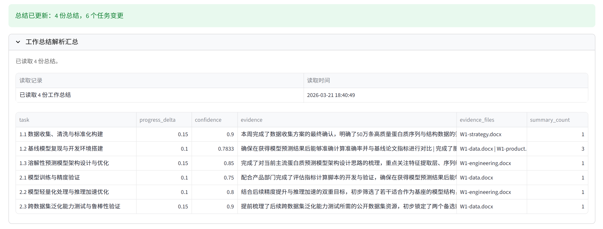
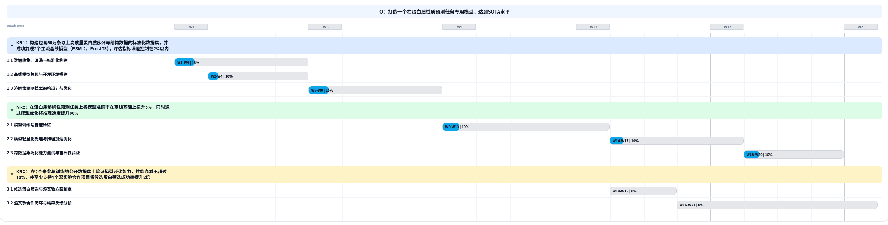
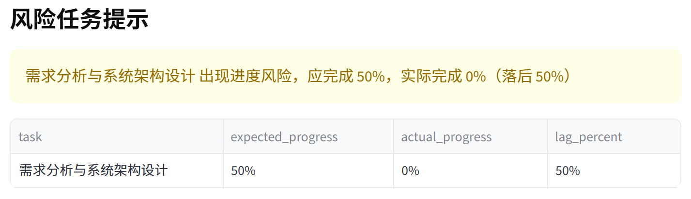
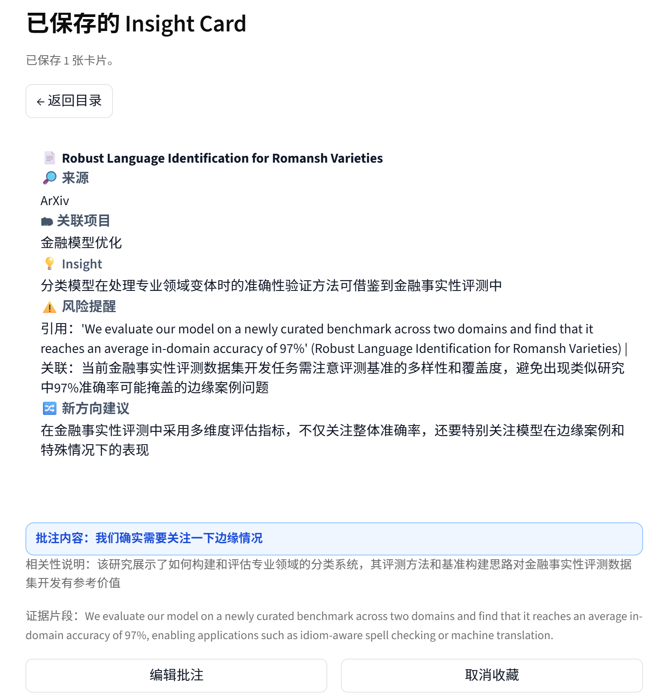
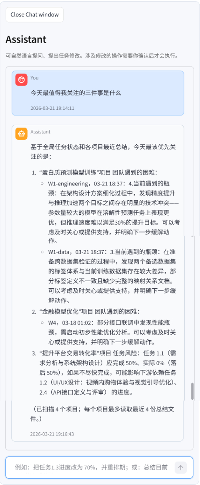

# Project Copilot

> 🧠 Your thinking partner for complex projects  
> 🎯 把 OKR 变成任务、可视化时间线、风险雷达与每日 insight 的项目助手

| 🎯 Goal To Plan | 📅 Planning Views | ⚠️ Risk Radar | 💡 Daily Insight |
| --- | --- | --- | --- |
| 把 OKR 拆成可执行任务、依赖和排期 | 生成 Timeline、甘特图、依赖图与任务表 | 根据工作总结自动识别滞后与风险 | 持续补充来自论文、开源和社区的外部输入 |

`📝 规划 -> 📅 排期 -> 📈 跟进 -> ⚠️ 风险识别 -> 🌐 外部输入 -> 💬 对话式调整`

Project Copilot 是一个基于 Streamlit + LiteLLM 的本地优先项目助手。它不是一个只会“吐一份任务列表”的 demo，而是把 OKR 拆解、自动排期、工作总结解析、风险预警、insight 推送、记忆管理和聊天式修改放进同一个项目上下文里，方便你持续管理复杂项目。

## 🚀 开始使用

第一次跑起来只需要 3 步：安装依赖、启动 Streamlit、在侧栏完成 LLM 配置。

### 1. 📦 安装依赖

```bash
# Windows
python -m venv .venv
.venv\Scripts\activate

# macOS / Linux
python3 -m venv .venv
source .venv/bin/activate

python -m pip install -r requirements.txt
```

### 2. ▶️ 启动应用

```bash
streamlit run app/app.py
```

启动后，默认在浏览器打开 `http://localhost:8501`。

### 3. 🧭 第一次使用建议

1. 在左侧边栏 `LLM 配置` 中选择 Provider、模型和 API Key。
2. 新建一个项目。
3. 粘贴你的 OKR。
4. 输入项目完成周数（例如 `12`，表示计划总时长锁定为 12 周）。
5. 选择 `单Agent` 或 `多Agent` 任务生成模式。
6. 生成计划后查看时间线、依赖图和任务表。
7. 指定团队工作总结文件夹，增量更新任务状态。
8. 打开右侧 Assistant，对任务规划或完成状态进行问答、修改或重规划。

## 📚 目录

<details>
<summary>展开章节导航</summary>

- ✨ 简介
- 🧩 Project Copilot 能做什么
- 🧭 使用流程
- 🧪 使用案例
- ⚙️ 核心功能
- 🗂️ 项目结构
- 🛠️ 技术栈
- 🔧 配置说明
- 🧠 数据与记忆文件
- 🪵 调试与日志
- 💡 Tips

</details>

## ✨ 简介

Project Copilot 解决的不是“怎么生成一份漂亮计划书”，而是“计划生成后，怎样持续让它跟现实保持同步”。

### 😵 常见痛点

| 你会遇到的问题 | Project Copilot 怎么处理 |
| --- | --- |
| OKR 写得很好，但落不到可执行任务和合理排期上 | 用 LLM 把目标拆成任务、依赖和时间安排 |
| 周报、日报、会议纪要很多，没人愿意手动逐项更新任务进度 | 自动解析工作总结并聚合进度更新 |
| 风险信息分散，项目负责人没时间把它们拼起来 | 对比计划进度与实际进度，自动标记 `At Risk` |
| 项目推进时只盯内部执行，缺少来自论文、开源项目、博客社区的外部输入 | 按天推荐高相关 insight card |
| 想用自然语言修改任务，但又不希望 assistant 乱改状态、直接落盘 | 先生成待执行修改，确认后再落盘 |

### 🧩 它给出的应对方式

- `🧠` 用 LLM 把 OKR 转成任务和依赖关系
- `🗓️` 自动排出带起止时间的计划
- `📝` 读工作总结，推断任务进度增量并做风险判断
- `💡` 基于当前项目上下文，按天推送 1-3 条高相关 insight card
- `💬` 通过聊天做工作情况查询、任务修改和重规划，但涉及修改的内容执行前必须确认

### 🛡️ 为什么它相对更安全

相较于 OpenClaw 这类更偏“代你操作”的智能体，Project Copilot 的安全性更多来自能力边界更收敛，而不是依赖模型“自觉”。当前实现里：

> [!NOTE]
> 相较于更偏“代你操作”的通用代理，Project Copilot 更强调 **本地优先、能力边界明确、修改需确认**。

- 代码里的外部命令调用是固定用途，主要用于解析 `.doc` 文件和调用只读 Reddit 脚本，而不是把自然语言直接拼成 shell 命令执行
- 聊天中的任务修改不会直接落盘，而是先保存为待执行修改，只有用户明确输入“确认执行”后才会真正应用
- 外部社区输入走的是 `reddit_read_only` 只读链路（也可在设置中手动关闭该功能），只获取公开内容，不提供发帖、回复、投票或管理等写操作
- 项目状态和 assistant 状态保存在本地 `state/` 下的 JSON 文件里，整体更接近**本地优先**、可确认的项目分析工具，而**不是接管浏览器、桌面或账号的通用执行代理**

## 🧩 Project Copilot 能做什么

### ✅ 它能做的事

- `🧱` 把 OKR 拆成任务列表，并自动补充依赖关系与时间安排
- `📊` 生成甘特图和依赖图，支持导出
- `📝` 读取团队工作总结文件夹，自动更新任务状态和风险项
- `💡` 结合项目上下文，手动生成今日 1-3 张 insight card
- `💬` 通过自然语言对计划进行问答、修改建议、批量修改建议或整体重规划
- `📈` 为你总结团队的整体工作情况
- `🌍` 在多项目场景下回答“今天最值得我关注的三件事是什么”这类全局优先级问题


## 🧭 使用流程

从“粘贴 OKR”到“看到计划、风险和 insight”，主流程大致如下：

`新建项目 -> 输入 OKR -> 生成任务计划 -> 查看 Timeline / Dependency Graph / Task Table -> 导入工作总结 -> 识别风险 -> 用 Assistant 调整`

### 1. 🆕 新建项目

应用左侧边栏支持项目创建、切换和删除。每个项目都有独立的任务状态、总结读取记录、assistant 对话记录、insight feed 和项目记忆。

### 2. 🎯 输入 OKR，生成任务计划

在主界面输入 OKR 后，先填写“项目完成周数”，再选择两种模式：

- `完成周数`：例如输入 `12`，生成/重生成时会把计划总时长锁定为 12 周。
- 该约束会同时传给模型（提高初稿命中率）和排期器（保证最终总时长对齐）。
- 该约束仅在生成/重生成时生效，不会在日常手工微调时强制重压缩。

- `单Agent`：一次生成任务和依赖，速度更快、成本更低
- `多Agent`：依次经过 `strategy -> plan builder -> review & refine` 三步，多一层审查与修正，结果通常更稳

生成后系统会：

- 识别 Objective 和 KR
- 生成任务及依赖关系
- 自动排期
- 按 KR 分组展示计划
- 渲染 Timeline、Dependency Graph、Task Table 三种视图

> [!TIP]
> 生成计划后，建议先把 `Timeline`、`Dependency Graph` 和 `Task Table` 三个视图对照看一遍，会更容易理解任务顺序、依赖约束和整体节奏。

### 3. 📤 下载可视化结果

当前支持：

- 甘特图导出为 `HTML`
- 依赖图导出为 `PNG`
- 任务表导出为 `CSV`

依赖图 PNG 导出依赖 `cairosvg`；该依赖已在 `requirements.txt` 中声明。

### 4. 📝 根据团队工作总结更新进度

你可以指定一个“工作总结文件夹路径”，系统会：

- 扫描文件夹中的总结内容
- 把多个总结中同一任务的进度更新聚合
- 根据任务进度，更新甘特图
- 对比计划进度与实际进度，识别 `At Risk` 任务
- 记录已经读取过的文件，下次只做增量更新

### 5. 💡 查看每日 insight feed

你可以点击“手动生成今日 Insight”按钮，基于当前任务上下文生成 1-3 张高相关 insight card。来源可配置，默认覆盖：

- ArXiv 论文
- GitHub 开源项目
- 博客 / Hacker News
- Reddit

你可以对卡片执行：

- `有用`
- `不相关`
- `保存`
- `取消保存`
- `深入看看`
- `添加批注`

这些反馈会被写入全局推荐规则记忆，影响后续 insight 排序与筛选。

### 6. 💬 用 Assistant 做查询和计划调整

右侧聊天窗口支持：

- 询问任务、依赖、总结、风险
- 修改任务名、负责人、状态、进度、工期、排期周区间（如 W7-W8）
- 新增任务 / 删除任务
- 修改依赖关系
- 一句话提出多个修改请求
- 对当前计划提出整体重规划请求

其中“修改类请求”不会立即执行，而是先生成待执行操作。只有在你回复 `确认执行` 后，变更才会真正落盘；回复 `取消执行` 则丢弃这次修改。

.jpeg>)
.jpeg>)

## 使用案例

### 1. 新项目立项

输入：

```text
O：打造“即看即买”的用户心智，将平台交易转化率提升30%
KR1： 电商模块的支付转化率（CVR）由2.5%提升至3.2%。
KR2： 用户从“浏览内容”到“完成加购”的平均路径时长缩短40%。
KR3： 挂链内容的渗透率（带商品链接的内容占总内容比例）由10%提升至25%。
```

输出：

- 一组按 KR 分组的任务
- 自动排好的开始/结束时间
- 可视化甘特图
- 依赖关系图

适合在立项、季度规划、路线图初稿阶段快速拉出第一版结构化计划。


.png>)

### 2. 周报 / 日报自动更新进度

把团队日报、周报、会议纪要统一放到一个文件夹中，点击“更新任务状态”后，系统会增量读取新文件，并将：

- 与任务相关的进展同步到已有任务，并更新甘特图
- 自动标出明显落后于预期节奏的任务
- 给出风险数和风险项列表

适合每周例会前快速刷新项目盘面。





### 3. 随时给项目补一条高质量外部输入

当项目进入推进期后，计划本身不是唯一输入。你可能还想知道：

- 最近有哪些论文提出了一些新想法
- 哪些开源实现可能可以借鉴
- 有没有社区讨论在提醒你潜在风险

Project Copilot 支持手动生成 1-3 张 insight card，并允许你长期积累偏好和批注。
.jpeg>)


### 4. 跨项目优先级判断

当你同时盯多个项目时，可以直接问：

```text
今天最值得我关注的三件事是什么？
```

系统会综合多项目任务状态、最近总结和风险情况，给出一份全局答案。



## 核心功能

### 1. OKR -> 任务拆解 -> 自动排期

规划主链路由以下模块组成：

- `planner/okr_planner.py`：单次任务生成与依赖解析
- `planner/multi_agent_planner.py`：多 Agent 编排
- `planner/agents/`：`strategy_agent`,`plan_builder_agent`,`review_refine_agent`
- `planning/scheduler.py`：根据依赖约束自动计算排期
- `planning/task_graph.py`：任务图构建

支持的依赖类型包括：

- `FS` Finish-to-Start
- `SS` Start-to-Start
- `FF` Finish-to-Finish
- `SF` Start-to-Finish

同时支持：

- `lag_weeks`
- `overlap_weeks`

这意味着生成的不是简单顺排列表，而是带约束关系的计划。

### 2. 基于工作总结的进度估计与风险预警

进度更新链路：

- `analysis/summary_parser.py`：读取和清洗总结文件内容
- `analysis/progress_estimator.py`：对每份总结提取任务进度增量
- `analysis/risk_predictor.py`：根据计划进度与实际进度差异做风险判断

当前支持读取的总结文件类型包括：

- `.txt`
- `.md`
- `.markdown`
- `.csv`
- `.log`
- `.json`
- `.docx`
- `.pdf`
- `.xlsx`
- `.doc`（会尝试调用外部转换工具做 best effort 读取）

风险判断规则非常直接：

- 先估计任务“按计划今天应该完成多少”
- 再对比“当前实际完成多少”
- 当落后比例超过阈值时，任务被标记为 `At Risk`

### 3. 每日 insight card 与反馈学习

insight 相关模块主要在：

- `insight/engine.py`
- `insight_recommendation_rule.md`
- `state/insight_url_history.json`

这条链路的几个关键点：

- 会从多来源抓取候选内容
- 会做去重，避免同一内容反复推送
- 会结合当前项目任务上下文做重排
- 用户的 `有用 / 不相关` 反馈会沉淀成全局推荐规则
- 保存后的卡片支持长期批注和回看

### 4. 对话式 assistant，但保持可控

assistant 不是“你一说它就直接改”的黑盒，而是“先生成结构化待执行变更，再由你确认执行”的工作流。

这部分逻辑主要在：

- `app/controller.py` 中的 `assistant_chat`
- `state/assistant_memory.py`
- `memory/MEMORY.md`
- `memory/projects/<project_id>/MEMORY.md`

能力包括：

- 读懂最近对话上下文中的指代
- 对任务和依赖做结构化变更建议
- 支持批量修改
- 对明显需要整体调整的请求触发 `replan`
- 把稳定偏好和项目事实写入系统/项目记忆文件

### 5. 全局项目风险聚焦

除了项目内问答，assistant 还支持识别类似下面的问题：

- `今天最值得我关注的三件事是什么？`
- `最近所有项目里最需要优先处理的风险有哪些？`

系统会读取跨项目任务状态和最近总结，识别整体风险和团队遇到的困难，帮你把精力集中到可能更需要干预/关心的事情上。

## 项目结构

### 目录总览

```text
.
├── app/                    # Streamlit UI 与控制层
├── analysis/               # 总结解析、进度估计、风险预测
├── insight/                # 多来源 insight 检索、筛选与重排
├── planner/                # OKR -> 任务生成，多 Agent 工作流
├── planning/               # 排期与任务图
├── providers/              # LLM Provider 抽象
├── state/                  # 项目状态、assistant 状态、insight 状态
├── memory/                 # 系统记忆与项目记忆
├── utils/                  # LLM、JSON、通用工具函数
├── visualization/          # 甘特图与依赖图渲染
├── data/debug/             # 调试日志
├── config.example.json     # 空白 LLM 配置示例
├── requirements.txt        # Python 依赖
└── insight_recommendation_rule.md  # 全局 insight 推荐规则记忆
```

### 主流程结构

```text
OKR 文本
	-> planner/
	-> planning/
	-> state/projects/{project_id}.json
	-> visualization/
	-> Streamlit Dashboard

工作总结文件夹
	-> analysis/summary_parser.py
	-> analysis/progress_estimator.py
	-> analysis/risk_predictor.py
	-> state/projects/{project_id}.json
	-> 风险提示 / 任务状态更新

项目上下文 + 当前任务
	-> insight/engine.py
	-> 每日 insight feed
	-> 用户反馈
	-> insight_recommendation_rule.md

用户聊天指令
	-> assistant_chat
	-> 待执行变更
	-> 确认执行 / 取消执行
	-> state + memory
```

## 技术栈

| 组件 | 说明 |
| --- | --- |
| Language | Python 3.10+ |
| UI | Streamlit |
| LLM 接入 | LiteLLM + 自定义 provider registry |
| 可视化 | HTML / SVG / PNG（依赖 CairoSVG） |
| 持久化 | 本地 JSON + Markdown |
| 凭据管理 | keyring |
| 文档解析 | 纯文本 + Office / PDF best effort 读取 |
| 记忆机制 | 系统记忆 + 项目记忆 + insight 反馈规则 |

## 配置说明

### 1. LLM 配置

应用左侧边栏提供完整的 `LLM 配置` 面板，支持设置：

- `Provider`
- `Base URL`（可先选预设，再手动修改）
- `任务生成模型（Generate Task）`
- `Assistant 模型`
- `Progress 模型`
- `Max Tokens`
- `Progress 并发数`
- `Progress 输出上限 Tokens`
- `API Key`（保存后下次不再直接展示）

当前代码内置了多家 Provider 预设，包括：

- OpenAI
- OpenRouter
- Anthropic
- Zhipu
- DashScope
- DeepSeek
- Groq
- Gemini
- Moonshot
- MiniMax
- AiHubMix
- SiliconFlow
- VolcEngine
- GitHub Copilot
- OpenAI Codex
- Ollama
- vLLM
- 自定义 OpenAI-Compatible 接口

其中：

- fresh clone 后默认不会附带已选中的 Provider；应用会先显示“未配置”状态
- Base URL 会按所选 Provider 提供默认预设；如果你的接入点不是默认地址，也可以直接手动改写
- `config.json` 是本地文件，在你第一次保存 LLM 配置后自动生成，并已加入 `.gitignore`
- `config.example.json` 只提供一个空白示例，不会被运行时直接使用
- API Key 默认按 Provider 分开保存在系统凭据库中，不写入 `config.json`

一个简化的配置示例如下：

```json
{
	"provider": "<your-provider>",
	"providers": {
		"<your-provider>": {
			"base_url": "<your-base-url>",
			"model": "<task-generation-model>",
			"assistant_model": "<assistant-model>",
			"progress_model": "<progress-model>",
			"max_tokens": 3000,
			"progress_max_workers": 3,
			"progress_llm_max_output_tokens": 5000
		}
	}
}
```

### 2. 任务生成模式

- `单Agent`：适合快速起草第一版计划
- `多Agent`：适合更重视结构稳定性、愿意多花一点时间和 token 的场景

### 3. Insight 配置

Insight 设置为工作区全局设置：

- insight 总开关
- 各来源是否启用


### 4. 风险阈值与个性化

当前 UI 中还支持：

- 设置风险预警阈值
- 复用上一次风险阈值
- 切换甘特图主题

内置甘特图主题包括：

- `default`默认多彩风格
- `minimal`简约风格
- `retro`复古色调

## 数据与记忆文件

这个项目默认不使用数据库，核心数据都能在仓库目录中找到。

### 状态文件

- `state/projects_registry.json`：项目注册表
- `state/projects/<project_id>.json`：单项目任务、依赖、总结状态、assistant 状态、insight 状态
- `state/insight_url_history.json`：全局 insight URL 去重历史

### 记忆文件

- `memory/MEMORY.md`：系统级共享记忆
- `memory/projects/<project_id>/MEMORY.md`：项目级重要信息记忆
- `insight_recommendation_rule.md`：基于用户反馈不断更新的 insight 推荐规则记忆

### 这些文件各自解决什么问题

- `state/`：让应用重启后仍然保留项目状态
- `memory/`：让 assistant 记住长期偏好、术语和项目事实
- `insight_recommendation_rule.md`：让 insight 推荐不是“一次性的”，而是越用越懂你

## 调试与日志

调试信息主要写在 `data/debug/` 中，常见文件包括：

- `llm_attempt_log.txt`：LLM 请求尝试记录
- `llm_debug_log.txt`：任务规划调试日志
- `progress_timing_log.txt`：进度估计耗时日志
- `agent_debug_log.txt`：多 Agent 规划过程日志

如果你在排查以下问题，这些日志会很有用：

- 为什么某次任务生成失败
- 为什么返回 JSON 不可解析
- 为什么工作总结解析速度很慢
- 为什么多 Agent 某一步输出异常

## Tips

- `Generate Task` 建议用推理能力更强的模型；`Assistant` 和 `Progress` 可以优先选更快、更便宜的模型。
- `Progress 并发数` 最好和你所选 Provider 的限速能力匹配。
- 同一个项目尽量长期复用同一个“工作总结文件夹”，这样增量更新最稳定。
- 如果你希望assistant将某一事实写进记忆文件，加上“记住...”可能会更稳妥，你也可以在左边栏手动编辑记忆文件
- 甘特图支持缩放，可在甘特图右上角调节显示大小
- 如果窗口有遮挡，可以点击箭头进入/退出全屏
- assistant聊天窗口与“当前项目”绑定，如果你不是想进行全局查询/操作，请注意核对“当前项目”是否是你要和assistant交谈的对象
- 如果依赖图无法导出 PNG，优先检查 `cairosvg` 是否正确安装。